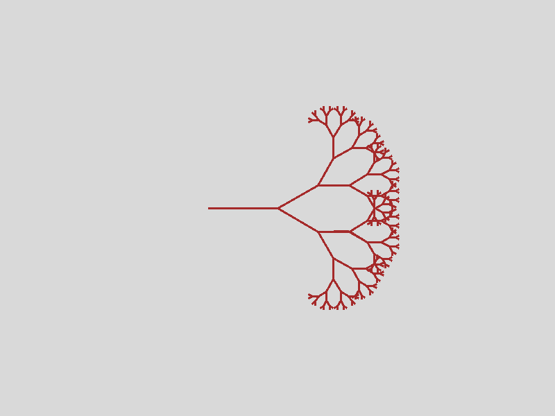

# Tema **PDraw**, grupo **pdraw-t12**
-----

## Indíce
- [Tema **PDraw**, grupo **pdraw-t12**](#tema-pdraw-grupo-pdraw-t12)
  - [Indíce](#indíce)
  - [1. Introdução](#1-introdução)
  - [2. Constituição dos grupos e participação individual global](#2-constituição-dos-grupos-e-participação-individual-global)
  - [3. Instalação e Utilização](#3-instalação-e-utilização)
    - [3.1 Instalação](#31-instalação)
    - [3.2 Utilização](#32-utilização)
  - [4. PDraw, visão geral da linguagem](#4-pdraw-visão-geral-da-linguagem)
    - [Operações](#operações)
    - [Propriedades da Caneta](#propriedades-da-caneta)
  - [5. IPDraw, visão geral da linguagem](#5-ipdraw-visão-geral-da-linguagem)
    - [5.1 Documentação](#51-documentação)
  - [6. Arquitetura do Sistema](#6-arquitetura-do-sistema)
    - [6.1 Definição da Gramática](#61-definição-da-gramática)
    - [6.2 Geração de Código](#62-geração-de-código)
    - [6.3 Execução do Código](#63-execução-do-código)
    - [6.4 Verificação Semântica](#64-verificação-semântica)
    - [6.5 Tabela de Símbolos](#65-tabela-de-símbolos)
    - [6.6 Classes IType](#66-classes-itype)
    - [6.7 Handling de Erros](#67-handling-de-erros)
  - [7. Requisitos e Características Implementadas](#7-requisitos-e-características-implementadas)
      - [Mínimos:](#mínimos)
      - [Desejáveis:](#desejáveis)
      - [Avançadas:](#avançadas)
  - [8. Exemplos](#8-exemplos)
  - [Contribuições](#contribuições)

## 1. Introdução
- O trabalho que nos foi atribuido tinha como objetivo o desenvolvimento de uma linguagem que permite desenho de imagens, usando como abstração o desenho livre com canetas.

- A ideia segue a abstração inerente à biblioteca turtle do python. Em conversas dentro do grupo, decidimos que a linguagem responsável por gerar código ia ser java, e o código iria ser gerado em python. A bibliteca gráfica utilizada foi a biblioteca graphics.py, decisão tomada com o auxilio do professor Miguel.

- As ferramentas utilizadas por nós para concretizar os objetivos foram o ANTLR4 lecionado nas aulas, StringTemplates para geração de código e o conhecimento em java e python. Como ambiente de desenvolvimento utilizámos o Visual Studio Code e usámos o Git para controlo de versões.

## 2. Constituição dos grupos e participação individual global

| NMec | Nome | Participação |
|:---:|:---|:---:|
| 113786 | GABRIEL MARTINS SILVA | 16% |
| 114614 | MARTIM JOSÉ SOUTO MARQUES DOS SANTOS | 16% |
| 115665 | RAFAEL JORGE CRAVEIRO MIRANDA SEMEDO | 16% |
| 113765 | RUI DE FARIA MACHADO | 16% |
| 114624 | SEBASTIÃO LEITE RESENDE TEIXEIRA | 20% |
| 108615 | TIAGO FONSECA CRUZ | 16% |

## 3. Instalação e Utilização
- Para instalar e utilizar o projeto, siga os seguintes passos:

### 3.1 Instalação
- Para instalar o projeto, é necessário ter o Java e o Python instalados na máquina.
- Para instalar o ANTLR4, siga as instruções em [https://www.antlr.org/](https://www.antlr.org/).
- Para instalar as dependências do graphics.py, execute o seguinte comando:
```bash
# (for apt-based)
sudo apt-get install python3-tk
# install antlr4-python3-runtime
pip install antlr4-python3-runtime
```

### 3.2 Utilização
- Para utilizar o projeto, siga os seguintes passos:
```bash
cd src
bash compile.sh <file.pdraw> [-o <outputdir>] [-a <ipdraw>] [-m <mainoutputfile>]
# Exemplo
bash compile.sh ../examples/p1.pdraw -o ../output -a ../examples/p1.ipdraw
# Run
cd ../output
python3 run.py

# By default, the output directory is ./out and the main output file is run.py
# -a can be used multiple times to include multiple IPDraw files
# -h for help
```

## 4. PDraw, visão geral da linguagem
- Linguagem principal do projeto em desenvolvimento, que permite o desenho de imagens usando como abstração o desenho livre através de canetas.

- A caneta tem como propriedades, *color*, *pressure*, *thickness*, *orientation* e *position*.

### Operações

| Operador | Exemplo | Descrição |
|:---:|:---|:---|
| + | _a_ + _b_ | Retorna a soma entre _a_ e _b_ |
| - | _a_ - _b_ | Retorna a diferênça entre _a_ e _b_ |
| + | +_a_ | Retorna a |
| - | -_b_ | Retorna o simétrico de a |
| * | _a_ * _b_ | Retorna o produto entre _a_ e _b_ |
| / | _a_ / _b_ | Retorna a divisão entre _a_ e _b_ |
| \\\\ | _a_ \\\\ _b_ | Retorna o resto da divisão entre _a_ e _b_ |
| // | _a_ // _b_ | Retorna a divisão inteira entre _a_ e _b_ |
| º | _X_ º | Converte o literal _X_ de graus para radianos |
| down | _pen_ down | _pen_ está a desenhar* |
| up | _pen_ up | _pen_ está levantada* |
| forward | _pen_ forward u | _pen_ avança u pixéis para a frente* |
| backward | _pen_ backward u | _pen_ recua u pixéis para trás* |
| left | _pen_ left u | _pen_ roda u radianos para a esquerda* |
| right | _pen_ right u | _pen_ roda u radianos para a direita* |
| pause | _pen_ pause u | interrompe a execução durante u microsegundos* (pode ser usada sem _pen_) |

\* As operações são executadas sobre a caneta retornam a própria caneta.

### Propriedades da Caneta

| Propriedade | O que é? |
|:---|:---|
| color | Define a cor da caneta |
| pressure | Define a pressão da caneta se for negativa a caneta está levantada |
| thickness | Define a espessura do traço |
| orientation | Define a orientação da caneta |
| position | Define a posição da caneta no canvas |


## 5. IPDraw, visão geral da linguagem
- IPDraw é uma versão simplificada e interpretada da linguagem PDraw. Nesta linguagem secundária, existe apenas uma caneta implícita, passada pelo programa compilado, facilitando o desenho através de comandos diretos e simples.

### 5.1 Documentação
- Quanto às variáveis e propriedades, assemelha-se muito à gramática da linguagem principal. Daí não repetirmos isso nesta secção.

- Quanto às operações, o mesmo acontece. Para além disso as operações da caneta são executadas sobre a caneta passada pelo ficheiro .pdraw. Sendo assim, estás operações não retornam nada, não sendo possível efetuar operações em cadeia.

- Não foram definidas funções na gramática secundária.

## 6. Arquitetura do Sistema
- A arquitetura do sistema é composta por diversos componentes que incluem a definição da gramática, a geração do código, e a execução do código gerado.

### 6.1 Definição da Gramática
- Utilizámos o ANTLR4 para definir a gramática das linguagens PDraw e IPDraw. A gramática está definida nos arquivos pdraw.g4 e pen.g4.
- A gramática da linguagem PDraw está definida no arquivo pdraw.g4. A gramática da linguagem IPDraw está definida no arquivo pen.g4.

### 6.2 Geração de Código
- A geração de código é feita utilizando StringTemplates em Java. O código gerado é Python, utilizando a biblioteca graphics.py para desenhar as imagens, ao qual são agrupados ficheiros auxiliares.

### 6.3 Execução do Código
- A execução do código é feita através de um interpretador.
- O interpretador foi implementado em Python e está definido nos arquivos interpreter.py e penMain.py. Este interpretador é responsável por executar os comandos das linguagens PDraw e IPDraw.

### 6.4 Verificação Semântica
- A verificação semântica é feita durante a análise semântica das linguagens PDraw e IPDraw, prévia à geração de código e interpretação, respetivamente.

### 6.5 Tabela de Símbolos
- A tabela de símbolos é utilizada para resolver contextos de declaração e escopo de variáveis. A tabela de símbolos foi implementada em Java e está definida no arquivo [SymbolTable.java](src/compiler/symbols/SymbolTable.java)
- De forma simplista, a tabela de símbolos é uma estrutura que armazena scopes que, por sua vez, contêm um conjunto de símbolos.
- Cada símbolo, por sua vez, contém um tipo e um valor.

### 6.6 Classes IType
- As classes IType são utilizadas para representar os tipos de dados da linguagem PDraw. As classes IType foram implementadas em Java e estão definidas no arquivo [IType.java](src/compiler/types/IType.java).
- Ele tem como objetivo criar uma abstração para os tipos de dados da linguagem, permitindo a manipulação de variáveis de forma genérica. Elas permitem a existência de tipos compostos.
- Na base da representação dos tipos de dados, temos um Enum que define os tipos primitivos da linguagem.

### 6.7 Handling de Erros
- É de destacar a implementação de um sistema de logs bastante completo para a deteção de erros e warnings durante a compilação e execução do código. Este sistema de logs foi implementado em Java e está definido no arquivo [ErrorHandler.java](src/compiler/ErrorHandler.java).
- Ele fornece não só a deteção de erros e da sua localização, mas também a sua descrição e representação da linha onde ocorreu o erro.
- Os erros são classificados em 3 tipos: INFO, WARNING e ERROR.
- Os erros sintáticos são acumulados com os erros semânticos através da implementação de um [ErrorHandlingListener](src/compiler/ErrorHandlingListener.java).

## 7. Requisitos e Características Implementadas

#### Mínimos:
| Requisito | Status | Descrição | Funcionalidades | 
|:---:|:---:|:---|:---|
| Definição de Canetas | Fully Completed | As canetas podem ser definidas com propriedades como cor, posição, orientação, espessura e pressão. Cada definição de caneta tem um identificador único. | [x] Definição de canetas;<br/>[x] Atributos de canetas (cor, posição, orientação, espessura, pressão). |
| Tipos de Dados | Fully Completed | São suportados os tipos de dados Integer, Real, String, Boolean e Point. | [x] Integer;<br/>[x] Real;<br/>[x] String;<br/>[x] Boolean;<br/>[x] Point. |
| Expressões Aritméticas | Fully Completed | Suporte para operações aritméticas envolvendo tipos de dados Integer e Real. | [x] Operações do mesmo tipo;<br/>[x] Operações entre tipos. |
| Escrita no Standard Output | Fully Completed | Suporte para escrita e concatenação de variáveis e texto no standard output. | [x] Escrita no output;<br/>[x] Concatenação de expressões. |
| Leitura do Standard Input | Fully Completed | Permite a leitura de valores a partir do standard input. | [x] Leitura stdin. |
| Conversão de Tipos | Fully Completed | Suporte para conversão de variáveis entre tipos, desde que a conversão seja possível. | [x] Conversão para Integer;<br/>[x] Conversão para Real;<br/>[x] Conversão para String;<br/>[x] Conversão para Boolean. |
| Movimentação e Rotação de Canetas | Fully Completed | Instruções para mover e rotacionar as canetas no canvas. | [x] Movimentar para frente e para trás;<br/>[x] Rotacionar para esquerda e direita. |
| Mudança de Atributos de Canetas | Fully Completed | Permite mudar atributos das canetas como cor, espessura, pressão e orientação. | [x] Mudança de cor;<br/>[x] Mudança de espessura;<br/>[x] Mudança de pressão;<br/>[x] Mudança de orientação;<br/>[x] Mudança de posição. |
| Instrução de Pausa | Fully Completed | Implementação da instrução de pausa para interromper a execução por um tempo especificado. | [x] Instrução de pausa. |
| Verificação Semântica | Fully Completed | Verificação da consistência de tipos de dados e detecção de colisões entre tipos diferentes. | [x] Verificação de tipos de dados;<br/>[x] Detecção de colisões de tipos. |

#### Desejáveis:
| Requisito | Status | Descrição | Funcionalidades | 
|:---:|:---:|:---|:---|
| Operações Booleanas | Fully Completed | Expressões booleanas do tipo x==y, x!=y, x<y, x>y, x<=y e x>=y estão implementadas, com suporte para variáveis Boolean. | [x] Comparações booleanas;<br/>[x] Variáveis booleanas. |
| Instrução Condicional | Fully Completed | Estruturas 'if' com suporte de 'else' opcional e leitura de expressões booleanas. | [x] Instruções if;<br/>[x] Instruções else. |
| Instruções Iterativas | Fully Completed | Suporte para loops do tipo 'for', 'while' e 'until'. | [x] Loop for;<br/>[x] Loop while;<br/>[x] Loop until. |
| Múltiplos Canvas | Fully Completed | Suporte para múltiplos canvas e seleção do canvas ativo. | [x] Múltiplos canvas;<br/>[x] Seleção do canvas ativo. |

#### Avançadas:
| Requisito | Status | Descrição | Funcionalidades | 
|:---:|:---:|:---|:---|
| Funções e Variáveis Locais | Fully Completed | Implementação de funções e suporte para variáveis locais dentro das funções. | [x] Definição de funções;<br/>[x] Variáveis locais em funções. |
| Tabela de Símbolos | Fully Completed | Implementação de uma tabela de símbolos para resolver contextos de declaração e escopo de variáveis. | [x] Tabela de símbolos;<br/>[x] Resolução de escopo. |

## 8. Exemplos
- Ficheiros de exemplo (fornecidos pelo professor) e de testes podem ser encontrados nas pastas [examples](examples) e [tests/1](tests/1). Entre estes, recomendamos os seguintes exemplos: [Tree.pdraw](tests/1/Tree.pdraw), [bounce.pdraw](tests/1/bounce.pdraw), [circle.pdraw](tests/1/circle.pdraw), [KochSnowFlake.pdraw](tests/1/KochSnowFlake.pdraw), [Mandelbrot.pdraw](tests/1/Mandelbrot.pdraw), [spiral.pdraw](tests/1/spiral.pdraw), [trigonometrics.pdraw](tests/1/trigonometrics.pdraw), etc.

- Em [tests/0](tests/0) estão exemplos de programas com erros de sintaxe e/ou semântica.

- Exemplo [Tree.pdraw](tests/1/Tree.pdraw):
```python
define pen PenType1 {
    color = brown;
    thickness = 3;
};

define canvas mainCanvas "" (800,600);

pen p1 = new PenType1;
p1 <- color brown;
p1 <- position (300, 300); 
p1 down;

int drawBranch(real length, real angle) {
    if (length < 5) {
        return 0;
    };
    
    p1 forward length;
    p1 right angle;
    
    drawBranch(length * 0.67, angle);
    
    p1 left( 2 * angle);
    
    drawBranch(length * 0.67, angle);
    
    p1 right angle;
    p1 backward length;
};

drawBranch(100, PI / 6);  % Initial length and angle

p1 -> stdout;
```



- Exemplo [Bounce.pdraw](tests/1/Bounce.pdraw) + [square.ipdraw](tests/1/square.ipdraw):
```python
define pen PenType1 {
    color = red;
    thickness = 3;
};

define canvas mainCanvas "" (800, 600);

pen p1 = new PenType1;
p1 <- color red;

int x = 400;
int y = 300;
int vx = 5;
int vy = 3;
int radius = 20;
int canvasWidth = 800;
int canvasHeight = 600;
int steps = 1000;

int i;
for (i = 0; i < steps; i = i + 1) {
    p1 <- position (x, y);
    p1 down;
    p1 <- execute "square.ipdraw";
    p1 up;
    
    x = x + vx;
    y = y + vy;
    
    if (x + radius > canvasWidth or x - radius < 0) {
        vx = -vx;
    };
    if (y + radius > canvasHeight or y - radius < 0) {
        vy = -vy;
    };
    
    pause 10000;
};

p1 -> stdout;
```
```
int radius = 20;
forward radius;
right (PI / 2);
forward radius;
right (PI / 2);
forward radius;
right (PI / 2);
forward radius;
right (PI / 2);
```


## Contribuições

- Durante o desenvolvimento do projeto, o aluno **Martim Santos** teve contibuições na gramática secundária, na análise semântica da linguagem principal, nos templates, no script compile.sh e no relatório, o aluno **Rui Machado** contribuiu no codeGen, na gramática principal, nos templates, na criação de classes IType e no relatório, o aluno **Sebastião Teixeira** contribuiu na gramática principal, na symbolTable, assim como classes acessórias, na análise semântica das linguagens principal e secundária, no handling de erros e geração de logs, em ambas as linguagens, na criação de ficheiros de exemplo, no script compile.sh, e na revisão/depuração de problemas, o aluno **Tiago Cruz** teve contribuições na gramática secundária, na análise semântica da linguagem principal, no interpretador da linguagem secundária e no relatório, o aluno **Rafael Semedo** contribuiu com o codeGen, na principal, e na análise semântica da linguagem secundária e o aluno **Gabriel Silva** teve contribuições na análise semântica da linguagem principal, no codeGen, nos templates, na criação de ficheiros de exemplo e na revisão/depuração de problemas.

